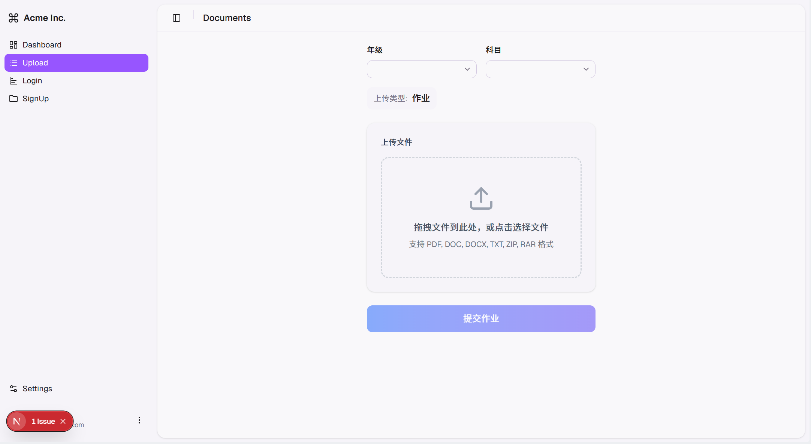
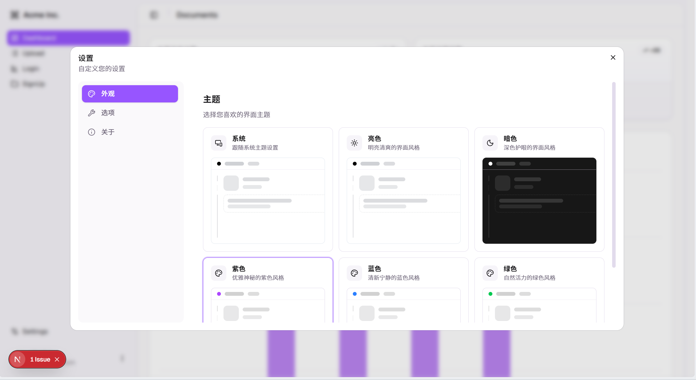
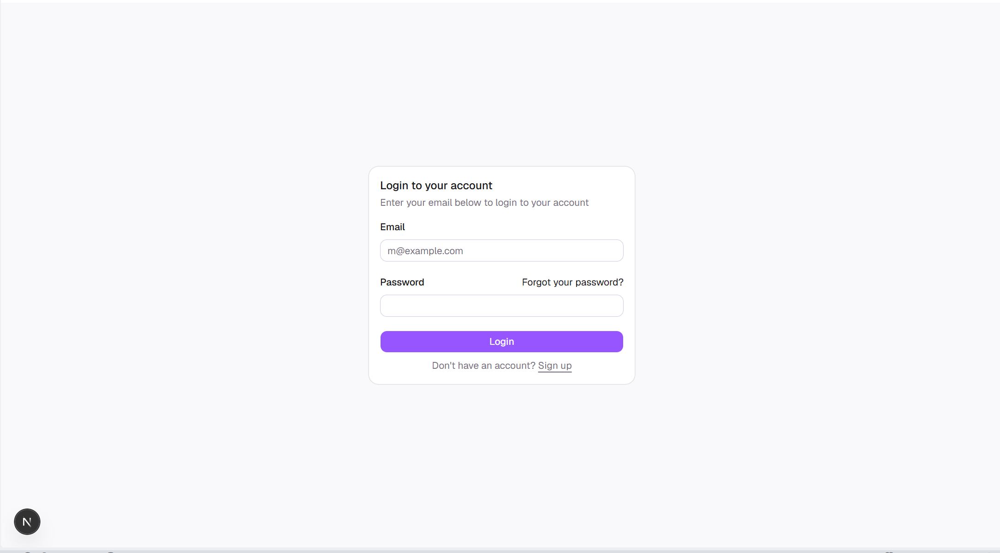
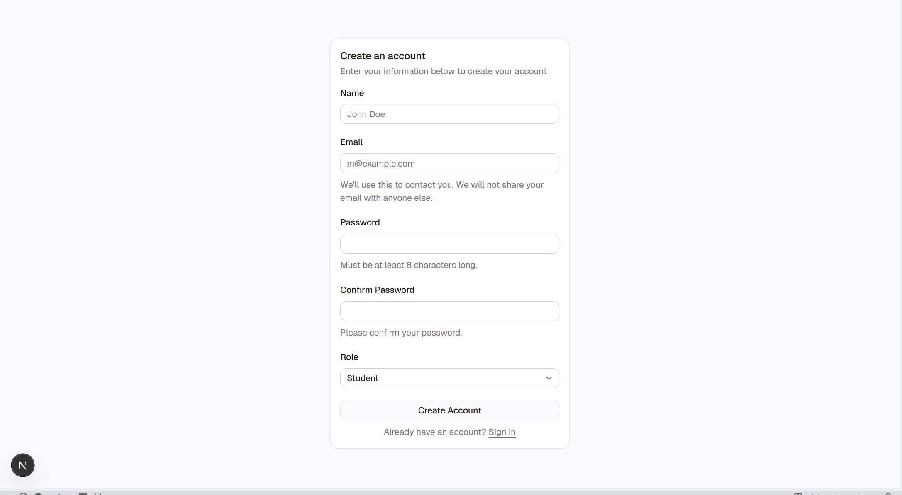
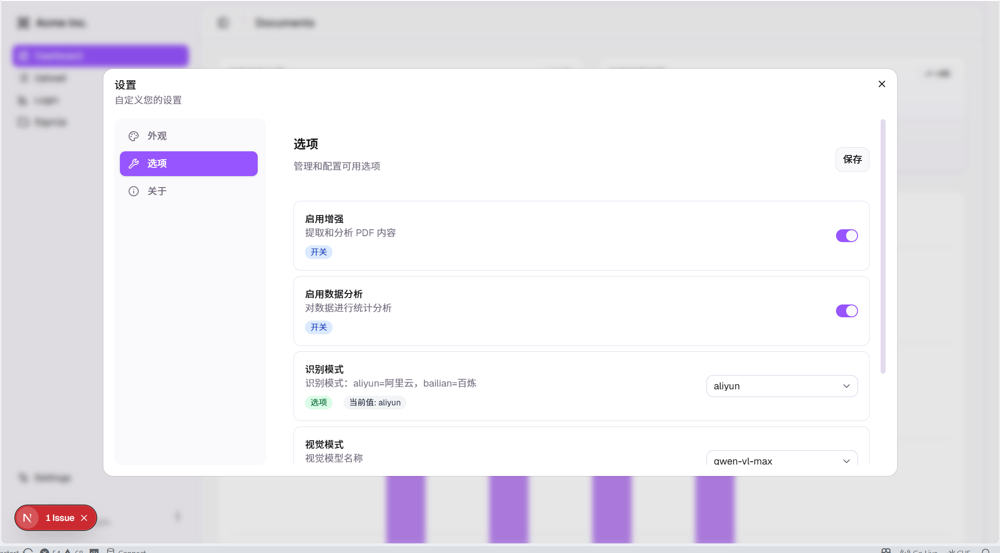

# Next.js App

一个基于 Next.js 16 构建的现代化 Web 应用。

## 演示

### 主界面


### 作业详情


### 题目提示


### 上传界面


### 主题界面


### 登录界面

### 注册界面

### 设置界面


## 技术栈

- **框架**: Next.js 16.1.7 (App Router)
- **语言**: TypeScript
- **样式**: Tailwind CSS 4
- **组件库**: shadcn/ui
- **图标**: Lucide React
- **状态管理**: React Hooks
- **表单验证**: Zod
- **表格**: TanStack React Table
- **拖拽**: @dnd-kit
- **图表**: Recharts
- **通知**: Sonner
- **HTTP 客户端**: Axios

## 快速开始

### 安装依赖

```bash
pnpm install
```

### 开发模式

```bash
pnpm dev
```

启动开发服务器，访问 <http://localhost:3000>

### 构建生产版本

```bash
pnpm build
```

### 启动生产服务器

```bash
pnpm start
```

### 代码质量检查

```bash
# 代码格式化
pnpm format

# ESLint 检查
pnpm lint

# TypeScript 类型检查
pnpm typecheck
```

## 项目结构
